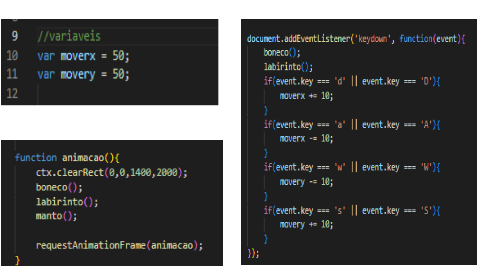

# Projeto Ilusao DJW
## Leonardo Macêdo Aurieni 
# Jogo: O labirinto da vida
Esse jogo é uma continuação do jogo de LP. Onde o jogador saiu da prisão e agora tem que atravessar o labirinto para pegar o Manto do Timão. 
As cores do labirinto foi escolhida por conta das cores do Timão, preto e branco.
 
## Como Jogar?
 
# HTML
Fiz uma estrutura simples de HTML e adicionei um canvas com id "canvas".
 
# CSS
Troquei sua cor de fundo para preto. 
 
# JavaScript
Comecei inicializando o canvas, depois configurei para ele ficar na tela toda. 
 
## Personagem
O personagem eu fiz com retângulos, círculos, retas e curva. 
Adicionei uma função 'boneco' nele que irei explicar. 
 
## Labirinto
Fiz o labirinto apenas com retas e mudei as linhas para branco. 
Adiciona uma função 'labirinto' nele que irei explicar. 
 
 
## Manto do Timão
Coloquei o Manto do Timão em forma de imagem. 
 

# Script de movimentação
Adicionei duas variáveis, uma para posição 'x' e outra para posição 'y'. Troquei as posições 'x' e 'y' dos desenhos do boneco pelas variáveis. 
Para movimentar o boneco eu usei apenas a função 'if', com as condições de apertar a tecla, que quando pressionada irá aumentar ou dimininuir '10' nas variáveis. 
Lembra das funções que eu criei no labirinto e personagem? Elas servirão na função 'animacao', onde quando acionada ela limpará toda a tela. Mas com as funções 'labirinto' e 'boneco' ela não limpará eles. 
 
# Jogo Funcionando 
https://github.com/Leo-Macedo/Projeto_Ilusao_DJW/assets/127630556/5e37ee3f-e85b-419a-bf7b-67efcfec6ad1

 
# Diagramas
## Diagrama de classes
 
<h3> Descrição </h3>
Esse é um Diagrama de Classes do Jogo do Labirinto. Que contêm as classes: Desenhos; Curva; Quadrado; Reta; Circulo; Personagem e Labirinto. 
As classes Curva, Reta, Circulo e Quadrado tem uma relação de herança com a classes Desenhos, onde herda todos os atributos dela. 
A classe Personagem tem relação de herança com Curva, Reta, Circulo e Quadrado que os utiliza para desenhar as partes dele. Também tem relação com o Labirinto que precisa dele, mas existe sem ele. 
O Labirinto tem relação de herança com Reta para desenhar suas paredes. 
<h2>Diagrama de casos de uso</h2>
 
<H3>Documentação</H3>
 
<H2>Diagrama de atividade (finalizar o labirinto)</H2>

